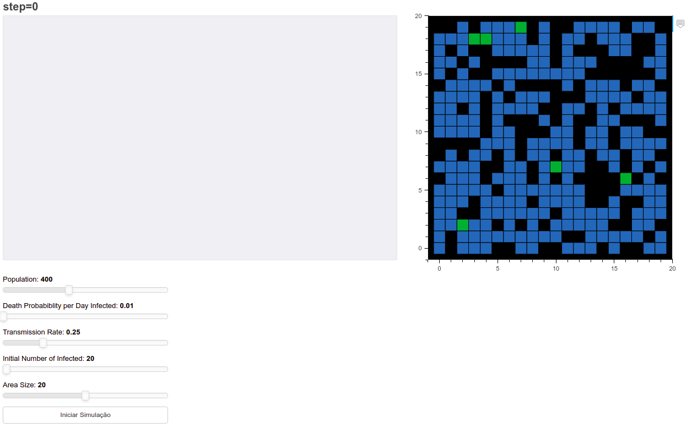
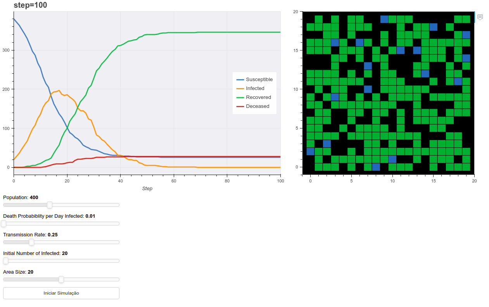

# Epidemic Simulation

**Disciplina**: FGA0210 - PARADIGMAS DE PROGRAMAÇÃO - T01 <br>
**Nro do Grupo**: 3<br>
**Paradigma**: SMA<br>

## Alunos
|Matrícula | Aluno |
| -- | -- |
| 17/0013651 | João Gabriel Antunes |
| 17/0163571 | Murilo Loiola Dantas |

## Sobre 
<p align="justify">&emsp;&emsp;O Epidemic Simulation é um projeto SMA que utiliza um modelo baseado em agente (ABM, sigla em inglês) para simular o fenômeno de propagação de uma doença que ocorre entre agentes, utilizando alguns valores críticos como a taxa de mortalidade, tempo de recuperação, taxa de infecção, tamanho da população e tempo de duração.</p>

<p align="justify">&emsp;&emsp;A visualização dessa simulação se dá por dois gráficos: um gráfico de linhas que é atualizado em tempo real e apresenta a quantidade de pessoas infectadas, sucetíveis à infecção, recuperadas e mortas. O outro gráfico é um *Grid* atualizado também em tempo real e que mostra o espaço amostral dinâmico com os agentes em movimento.</p>

<p align="justify">&emsp;&emsp;O modelo utilizado para a simulação de propagação foi o SIR (Susceptible, Infected, Removed) modificado, subdividindo a categoria REMOVED em RECOVERED e DECEASED. O SIR é o modelo mais simples para simulação de epidemias, pois desconsidera uma gama de fatores que impactam como a doença se espalha (decretos governamentais, capacidade do sistema de saúde, entre outros).</p>

## Screenshots
Programa em stand-by, aguardando entrada do usuário:



Simulação finalizada com parâmetros padrão:


## Instalação 
**Linguagens**: Python<br>
**Tecnologias**: Mesa, Bokeh<br>
Para rodar o projeto na sua máquina, é recomendado que utilize o Docker, devido às dependências do código. Para tal, primeiro garanta que o Docker e o docker-compose estejam instalados, para ter certeza, acesse a documentação dessa ferramenta disponível [aqui](https://docs.docker.com/get-docker/).

### Utilizando o Docker
Uma vez instalados, rode o seguinte comando no diretório do projeto:
```bash
docker-compose up --build
```

Caso já exista um container buildado, rode o comando:
```bash
docker-compose up
```

O programa estará disponível no local: localhost:5006/main.

### Utilizando pip3
Caso prefira não utilizar o Docker para rodar o projeto, ainda é possível instalar todos as dependências utilizadas rodando o seguinte comando:
```bash
pip3 install -r requirements.txt
```

Após a instalação dos módulos, se tudo der certo, use o comando para rodar:

```bash
bokeh serve --show main.py
```

## Uso 
Ao executar o programa, uma aba será aberta no navegador padrão, na porta 5006.

O usuário será apresentado com o estado inicial do programa, conforme a primeira figura.

O usuário pode utilizar os sliders presentes abaixo das plotagens para para configurar os parâmetros da simulação.

Clicar no botão Start Simulation iniciará a simulação. O usuário pode acompanhar os valores da simulação no gráfico de linhas. O plot de células apresenta os agentes em movimento.

## Vídeo
Adicione 1 ou mais vídeos com a execução do projeto.

## Outros 
Só é possível rodar uma simulação por execução do programa.

As cores representam os mesmos estados em ambas as plotagens.

No plot de células, mais de um agente pode ocupar a mesma célula. Um agente infectado pode infectar um agente suscetível que estiver na mesma célula que ele.

## Fontes
> 1. [Biblioteca Mesa para modelagem baseada em agentes.](https://github.com/projectmesa/mesa)
> 2. [Biblioteca Bokeh para plotagem dinâmica.](https://github.com/bokeh/bokeh)
> 3. [Exemplo de simulação ABM utilizando Mesa](https://dmnfarrell.github.io/bioinformatics/abm-mesa-python)